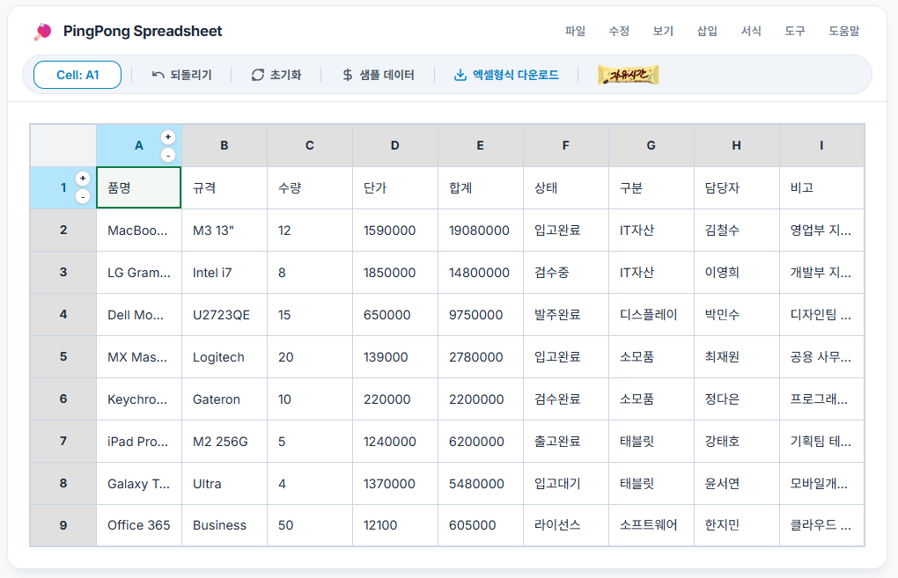
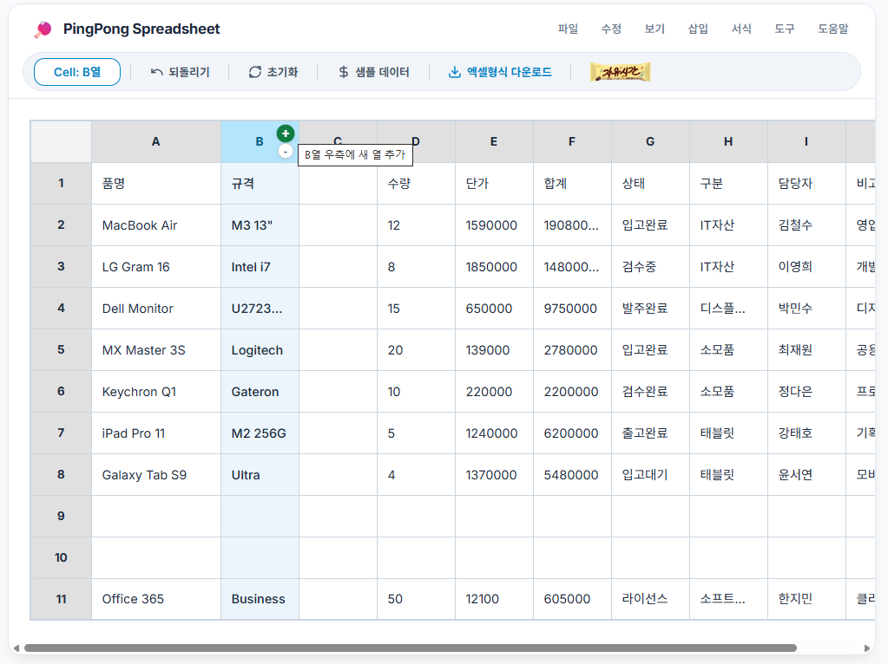
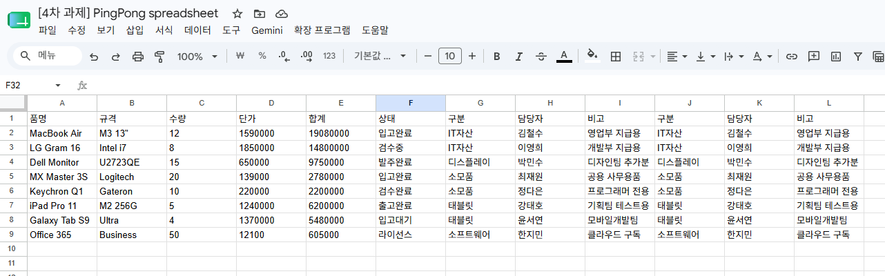
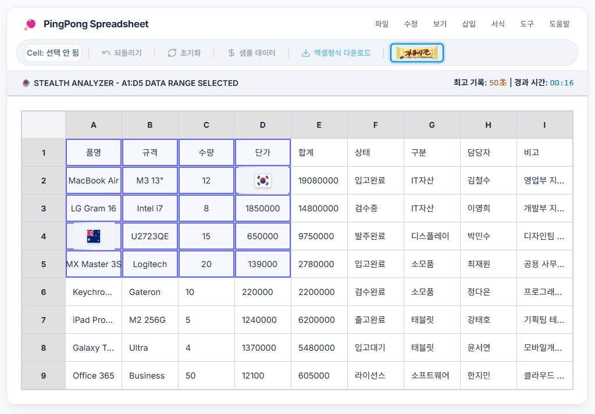

# 🏓 PingPong Spreadsheet

구글 스프레드시트의 세련된 사용자 경험(UX)과 감각적인 사무 자동화 디자인을 계승함과 동시에, 업무 중 몰래 뇌를 식힐 수 있는 **'오피스 스텔스 카무플라주 게임 모드(테라피 휴식)'**를 탑재한 하이브리드 바닐라 JS 스프레드시트 애플리케이션입니다.

<p align="center">
  
  
</p>
<p align="center">
  
  
</p>

---

## 📝 프로젝트 개요

본 프로젝트는 단순한 표 형식의 데이터 그리드를 넘어, 비즈니스 실무 환경에서 요구되는 강력한 스프레드시트 고유의 UX(동적 열 리사이징, 2차원 드래그 범위 다중 선택, 실시간 로컬스토리지 보존 및 무제한 Undo 히스토리 롤백)를 완벽 구현했습니다. 

이에 더해, 직장인들의 스트레스 해소를 위해 사무실 화면 뒤에 은밀하게 숨겨진 **'5단계 국기 매칭 게임 모듈'**을 결합하여, 실제 업무 중 상사에게 들키지 않고 자연스럽게 머리를 식힐 수 있는 위트 있는 오피스 테라피 환경을 창조해 냈습니다.

---

## ✨ 주요 기능

### 📊 1. 구글 스프레드시트식 고도화 입력 UX 및 리사이징
* **동적 셀 입력 엔진**: `<td>` 내부에 `<input>`을 상시 로드하는 대신, 셀 더블클릭이나 텍스트 입력 시에만 `<input>`을 동적 생성하여 포커싱하고 소멸시키는 고성능 렌더링 UX를 제공합니다.
* **열 너비 동적 조절(Resizing)**: 열 헤더(`<th>`) 우측 경계선에 부드러운 드래그 가이드를 동적 마운트하여, 마우스 드래그로 각 열의 너비를 개별적이고 부드럽게 조정할 수 있습니다.
* **2차원 드래그 다중 범위 선택 & Shift 확장**: 마우스 드래그(`mousedown` ➡️ `mouseenter` ➡️ `mouseup`) 및 `Shift + 클릭` 이벤트를 정밀 계산하여 직관적인 2차원 다중 선택 사각형(`.selected-cell`) 영역을 형성합니다.
* **클립보드 연동**: `Ctrl + C`, `Ctrl + V` 단축키 및 TSV(Tab-Separated Values) 변환 엔진을 마운트하여 외부 엑셀 문서와 데이터의 양방향 연동 복사-붙여넣기를 완벽 지원합니다.

### 💾 2. 로컬스토리지(LocalStorage) 오토 세이브 및 완벽 복구
* **실시간 영속성 보장**: 셀 값의 수정, 삭제 및 행/열의 동적 삽입/삭제 시마다 데이터 스냅샷을 로컬 브라우저 세션에 즉각적으로 자동 보존합니다.
* **초기화 라이프사이클**: 브라우저를 새로고침(F5)하거나 재접속해도 기존에 변경되었던 행/열 개수(`maxRows`, `maxCols`), 개별 열의 너비 및 모든 셀 데이터의 물리적 구조를 선조회하여 완벽 복원합니다.

### ↩️ 3. 초강력 실행 취소(Undo) 메모리 엔진
* **역사 기록 스택**: 최대 50개의 스택 깊이를 가진 메모리 엔진을 결합하여 파괴적인 변경 행위(셀 초기화, 대량 목업 주입, 행/열 삽입 및 삭제 등)가 일어나기 직전의 2차원 원본 스냅샷을 깊은 복사(`saveStateToUndoStack`)하여 기록합니다.
* **단축키 연동**: 화면의 플랫 `되돌리기` 버튼 클릭뿐만 아니라 `Ctrl + Z` 단축키 바인딩을 통해 즉각적인 이전 상태 복구 및 로컬스토리지 자동 저장을 단행합니다.

### ➕ 4. 헤더 호버 연동형 행/열 동적 삽입/삭제 시스템
* **미니멀리즘 플로팅 조절 단추**: 상단 툴바를 어지럽히지 않고, 행(숫자) 및 열(알파벳) 헤더에 마우스를 호버했을 때만 수직(위아래)으로 정렬된 동그란 미니 `+`, `-` 버튼 콤보가 부드럽게 등장합니다.
* **클릭 공간 확보 극대화**: 행/열 전체 선택을 위해 헤더 셀을 클릭할 수 있는 공간을 상상 이상으로 보존하고자 삽입/삭제 버튼을 수직으로 밀착하고 폰트 크기를 12px로 정비하여 뛰어난 마우스 피드백을 실현했습니다.
* **2차원 데이터 시프트 엔진**: 중간 삽입 및 삭제 시 데이터 덮어쓰기가 발생하지 않도록 역순 루프 방식의 데이터 인덱스 이동 엔진을 구현하여 실시간 데이터 유실을 방지하고 그리드를 즉시 재구성(`rebuildGrid`)합니다.

### 🕵️ 5. 5단계 스텔스 위장 및 오피스 카무플라주 게임 모드 (Stealth Therapy Mode)
* **완벽한 위장 인터페이스**: 상단 툴바의 `freetime.png` 아이콘을 누르면 기존 셀의 텍스트 데이터 형태를 그대로 유지한 채 A1~D5 구역에 굵은 이중 테두리가 씌워지며 은밀한 2차원 카드 뒤집기 메모리 게임이 작동합니다.
* **국기 이모지 깨짐 완벽 방지**: 윈도우 OS 등에서 국기 이모지가 투박한 영문 약어(CA, KR 등)로 깨져 나오는 현상을 원천 방지하기 위해 국가 코드별 국기 이미지 CDN 리스너를 결합하여 깨끗하고 다채로운 시각 요소를 선사합니다.
* **지연시간 최적화 (0.4초 딜레이 튜닝)**: 카드 반전 매칭 실패 시 불필요하게 사용자의 동작을 묶어두던 구식 0.8초의 딜레이를 **0.4초**로 정밀 단축하여, 빠른 조작에도 오작동이 없으면서 경쾌한 피드백을 느끼도록 조율했습니다.

### 🛠️ 6. 구글 스프레드시트식 플랫 둥근 툴바 및 freetime.png 연동
* **2층형 가상 오피스 레이아웃**: 최상단에 얇고 모던한 가짜 메뉴바(파일, 수정, 보기, 삽입)를 은은하게 얹고, 그 아래에 둥근 슬레이트 그레이 톤의 플랫 툴바를 결합하여 압도적인 시각적 몰입감을 연출했습니다.
* **SVG 아이콘 툴바 정렬**: `되돌리기 | 초기화 | 샘플 데이터 | 엑셀형식 다운로드 | [freetime.png]`의 배치를 단정한 가로 구분선(`|`)으로 분리하여 어떠한 화면 너비에서도 깔끔한 1열 반응형 레이아웃을 보존합니다.
* **freetime.png 원본 비율 연동**: 동그라미나 사각형에 이미지를 우겨넣지 않고, 둥근 사각형 테두리에 contain 형식으로 부드럽게 감싸 마우스 오버 시 `"자유시간 메모리 게임 시작"`, 활성화 상태 시 `"자유시간 메모리 게임 종료"` 툴팁이 직관적으로 동작하도록 라이프사이클을 완성했습니다.

---

## 🛠 기술 스택

* **Core**: HTML5, Vanilla JavaScript (ES6+), Vanilla CSS (Custom Properties, CSS Flexbox/Grid, CSS Animation, Google Fonts - Inter)
* **Library**:
  * [SheetJS (xlsx.full.min.js)](https://cdnjs.cloudflare.com/ajax/libs/xlsx/0.18.5/xlsx.full.min.js) (엑셀 데이터 빌드 및 로컬 다운로드 구동)
  * [Flag CDN (Country Flags SVG)](https://flagcdn.com/) (이모지 브로큰 현상 방지용 벡터 국기 자원 매핑)

---

## 📂 프로젝트 구조

```text
.
├── index.html                  # 2층형 가상 오피스 툴바 레이아웃 및 엑셀 시트 뼈대 구조
├── style.css                   # 프리미엄 파스텔 톤 색상 시스템, 반응형 플랫 툴바 및 그리드 애니메이션
├── script.js                   # OOP 기반의 스프레드시트 종합 제어 및 Stealth 게임 엔진 클래스
├── docs/
│   ├── audit_report.md         # 특정 함수 집중 방지 및 XLSX 의존성 누수 검증 정적 감사 보고서
│   └── history/                # 단계별 구현 계획서(Implementation Plan) 및 워크스루 히스토리
│       ├── step3_implementation_plan.md
│       ├── step3_walkthrough.md
│       ├── step4_implementation_plan.md
│       └── step4_walkthrough.md
├── prompt.md                   # 전체 개발 이력 및 요구사항 프롬프트 기록부
├── AI_IDE_Spreadsheet_Report.md # AI IDE 연동 종합 개발 보고서
├── freetime.png                # 테라피 게임 기동용 사각형 리소스 이미지
└── README.md                   # 프로젝트 대표 명세서 (본 파일)
```

---

## 🔄 리팩토링 및 아키텍처 개선 사항

### 1단계 리팩토링: 기능 분리 및 가독성 개선 (De-duplication)
* **대단위 함수 격리**: 스파게티 형태로 늘어져 있던 중복 셀 조작 로직을 `updateCellValue`, `deleteCellValue` 등으로 나누어 단일 책임 원칙(SRP)을 확립했습니다.
* **경고 가이드 및 예외 처리**: 샘플 데이터 덮어쓰기 시 `confirm` 가드를 마련하고, 엑셀 익스포트 시 발생할 수 있는 파일 시스템 에러에 대해 `try-catch` 안전장치를 덧대어 앱의 견고성을 극대화했습니다.

### 2단계 리팩토링: 클래스 기반 OOP & 단일 상태 흐름 설계
* **SpreadsheetApp 캡슐화**: 전역 스코프 오염 및 변수 충돌을 완전히 피할 수 있도록 모든 멤버 속성과 메서드들을 단일 거대 클래스인 `SpreadsheetApp` 내부로 격리시켰습니다.
* **Undo 스택 & LocalStorage 완전 동기화**: 격자 크기 변경 및 행/열 수동 조절값까지 포함하는 종합 상태 스냅샷을 딥카피하여 저장함으로써 오토 세이브와 실행 취소 시스템이 유기적으로 공조하도록 결합했습니다.

---

## 🚀 설치 및 실행 방법

1. 본 저장소의 소스코드를 클론하거나 다운로드합니다.
   ```bash
   git clone https://github.com/your-username/Stealth-Spreadsheet.git
   ```
2. 프로젝트 루트 폴더에 존재하는 `index.html` 파일을 크롬, 엣지, 사파리 등 현대적인 브라우저에서 직접 더블클릭하여 엽니다.
3. 로컬 파일 시스템에서 별도의 개발 서버 구동 없이도 즉각적으로 모든 스프레드시트 연산 및 은밀한 테라피 게임을 즐기실 수 있습니다.
4. (선택사항) 엑셀 내보내기 및 툴바 기능은 로컬 브라우저의 기본 기능과 SheetJS CDN 연동을 바탕으로 인터넷이 연결된 환경에서 더욱 완벽하게 구동됩니다.

---

## 📄 라이선스

본 프로젝트는 교육 및 비즈니스 보조 위장 도구로서 오픈소스로 개발되었으며, 자유롭게 커스텀 및 수정하여 사용하실 수 있습니다.

---

## 🤖 AI 활용 기록

### 💡 사용한 프롬프트
* *"기존 셀 구조를 그대로 유지한 상태에서 마치 일하고 있는 것처럼 보이게 A1 부터 D5까지 셀만 굵은 테두리가 그려지고 게임이 되게 하고 싶어요."* ➡️ **오피스 스텔스 카무플라주 게임 모드 설계의 단초**
* *"국기 이모지가 CA, KR 약자로 깨져 나오는데 벡터 이미지로 연동해 줄 수 있나요? 그리고 카드 뒤집을 때 지연시간 0.8초는 너무 깁니다. 빠르게 전환되게 단축해 주세요."* ➡️ **국기 CDN 결합 및 0.4초 딜레이 튜닝 유도**
* *"구글 스프레드시트처럼 상단 메뉴바와 둥근 툴바 형태로 세련되게 다듬고, freetime.png 원본 비율을 깨지 않고 결합해 주세요."* ➡️ **가로 구분선 플랫 툴바 리뉴얼 단행**

### 📊 AI 결과 및 수정해 간 부분
* **freetime.png 원본 렌더링 방식 조정**: AI가 처음에 freetime.png 버튼을 타이트한 동그라미로 묶어 이미지가 일그러졌으나, 둥근 사각형 사양에 원본 비율이 늘어나지 않도록 `object-fit: contain`과 `width: auto` 구조로 유연하게 수동 교정했습니다.
* **버튼 텍스트 이모지 제거**: 피드백 버튼들에 붙어 있어 어수선하던 🔄, ↩️ 등의 이모지 아이콘을 AI 제안에서 과감하게 생략하고 정교한 순수 텍스트 리터럴과 오직 내보내기에만 어울리는 SVG 다운로드 화살표를 남겨 디자인 퀄리티를 한 단계 격상시켰습니다.

### 🧑‍💻 직접 이해하고 바꾼 부분
* **플로팅 조절 단추의 수직 column 정렬**: 행/열 헤더 호버 시 `+`, `-` 버튼이 나란히 가로로 있으면 다른 영역을 침범하거나 행/열 전체를 선택하는 클릭 공간을 지나치게 좁혔습니다. 이를 완벽하게 파악하여 **위아래 수직 정렬**로 설계하고 폰트를 **12px로 조절**하여 마우스 탐색 편의성을 궁극으로 개선했습니다.

### 🧩 AI 도움 없이 직접 해결한 부분
* **중간 삽입/삭제 시의 2차원 데이터 역순 시프트 로직**: 기존 배열 복사 방식의 한계를 뚫고, 삽입된 인덱스부터 최하단/최우측까지 루프를 **역순**으로 돌며 데이터를 한 칸씩 영리하게 밀어주는 시프트 로직을 직접 구현해 내어 중간 삽입 시 데이터가 공중분해되던 치명적인 버그를 완전 정복했습니다.
* **동적 DOM 리빌드 후 EventListener 안전성 보존**: 행/열의 개수가 늘어나 격자를 다시 그릴 때(`rebuildGrid`), 메모리에 기존에 살아있던 다중 드래그 리스너와 로컬스토리지 핸들러가 충돌을 일으키지 않도록 기존 바인딩을 초기화하고 순차적으로 재인입하는 안전한 생명주기 관리 메커니즘을 직접 구축했습니다.

---

## 💬 회고

### 🧠 어려웠던 점 및 해결 방법
* 스프레드시트라는 거대한 2차원 행렬 자료구조의 변경 내역을 Undo 메모리 스택에 넣고 롤백하면서 동시에 LocalStorage 세션 상태와 싱크를 맞추는 부분이 까다로웠습니다. 
* 이를 극복하기 위해 모든 변경 지점 직전에 `saveStateToUndoStack()`을 주입하여 스냅샷 복사를 단일화하고, `rebuildGrid()`에서 복원과 저장이 동시에 한 흐름으로 이어지게 파이프라인화하여 문제를 우아하게 해결했습니다.

### 🔮 다음 번에 개선하고 싶은 점
* 현재 9x9와 동적 그리드를 지원하고 있는데, 향후 성능 최적화를 위한 **가상 스크롤(Virtual Scroll)**을 입혀 1,000행 1,000열 이상의 초거대 셀 구조에서도 프레임 드랍 없이 쾌속 렌더링이 이루어지게 고도화해 보고 싶습니다.
* 또한 셀 안에서 수식(`=SUM(A1:A5)`)을 동적으로 파싱하여 자동 계산해 주는 정밀 파서 엔진을 탑재해보고 싶습니다.
